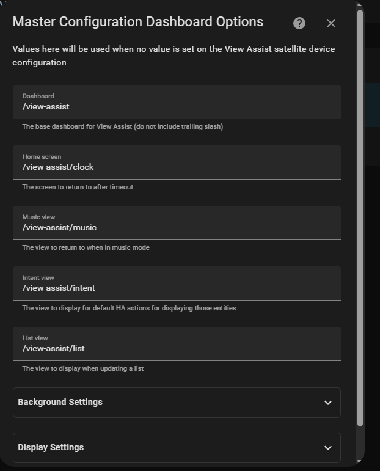
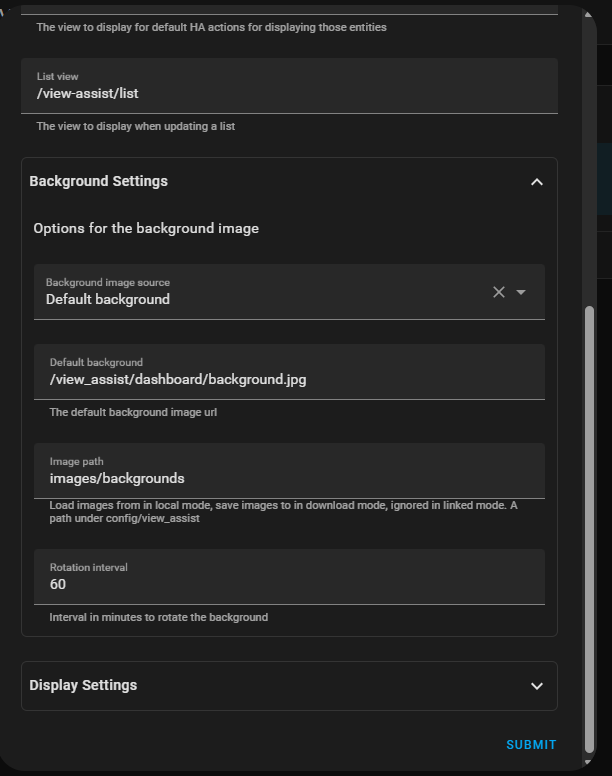
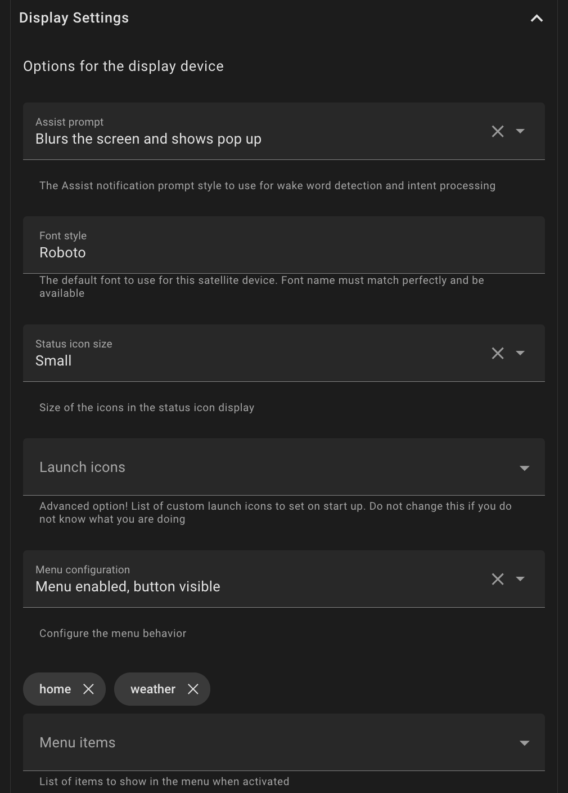
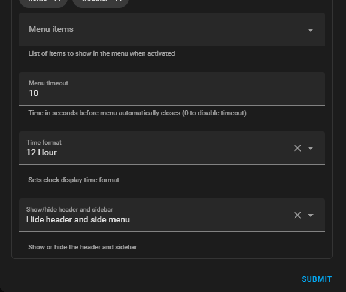

# Dashboard Options (Display enabled satellites only)

## General Settings



The dashboard options control different aspects of the View Assist display

- **Dashboard** - The base dashboard for View Assist (default /viewassist/)
- **Home screen** - The screen to return to after timeout (default /viewassist/clock)
- **Default Music View screen** - The view to return to when in music mode (default /viewassist/music)
- **Intent View Screen** - The view to display for default HA actions for displaying those entities (default /viewassist/intent)
- **List View** - The view for displaying Home Assistant list type data like shopping and to do lists (default /viewassist/list)

## Background Settings



- **Background Image Source** - This option is used to determine how the background image is handled. The options are:
  - **Default background** - Use a defined background image (see below)
  - **Local file path sequence** - Picks images in their sorted order from the image path defined below
  - **Local file path random** - Picks images randomly from the image path defined below
  - **Download random image from Unsplash** - Downloads a random image from Unsplash website then displays it
- **Default Background** - An image path to use as default background for all satellites (default /view_assist/dashboard/background.jpg)
- **Image path** - The file path that stores the predefined and downloaded images
- **Rotation interval** - Time in minutes between image rotations

## Display Settings




- **Assist Prompt** - The Assist prompt style to use for wake word and intent processing (default blur pop up)
- **Font Style** - The default font to use for this satellite device. Font name must match perfectly and be available (default Roboto)
- **Status Icons**
  - **Status Icon Size** - The size of the activated status icons shown in the top right corner
  - **Launch Icons** - List of status icons that are always visibile
  - **Menu Items** - List of status icons that are hidden in a toggleable menu
  - **Menu Timeout** - Time in seconds before menu automatically closes (0 to disable timeout)
  - <details>
    <summary><strong>Reference Guide</strong></summary>
        
    ## Icon Templates
    
    ### Predefined Templates
    
    View Assist includes ready-to-use templates:
    
    | Template | Description | Icon |
    |----------|-------------|------|
    | `home` | Navigate to clock view | home |
    | `weather` | Navigate to weather view | weather-sunny |
    | `menu` | Toggle menu display | menu |
    
    ### Custom Templates
    
    Create your own templates by adding them to `dashboard.yaml` emulating the custom templates [here](https://github.com/dinki/View-Assist/blob/b299657a96623f4e7fac25548550d34c9d8edae7/View%20Assist%20dashboard%20and%20views/dashboard/dashboard.yaml#L686-L775): <!-- Update line numbers when dashboard.yaml changes occur -->
    
    ```yaml
    # Example custom template
    webpage:
      type: custom:button-card
      template: icon_template
      icon: mdi:web
      tap_action:
        action: call-service
        service: view_assist.navigate
        service_data:
          device: '[[[ return variables.var_assistsat_entity ]]]'
          path: /view-assist/webpage
    
    # Example entity control template  
    living_room_lights:
      type: custom:button-card
      template: icon_template
      entity: light.living_room
      icon: mdi:lightbulb
      tap_action:
        action: toggle
      hold_action:
        action: more-info
    ```
    
    **Usage**: Reference your custom template name in configuration or service calls.
    
    ```yaml
      - home
      - weather
      - webpage                    # Custom template
      - living_room_lights         # Custom template
    ```
    
    ## Dynamic Status Icon Format
    
    Format: `type:target|icon`
    
    ### View Navigation (`view:target|icon`)
    Navigate to View Assist views or external paths.
    
    ```yaml
    - "view:weather|weather-sunny"               # Navigate to weather view
    - "view:webpage|web"                         # Navigate to webpage view  
    - "view:/lovelace/dashboard|view-dashboard"  # External dashboard
    ```
    
    - Paths without `/` are prefixed with `/view-assist/`
    - Paths with leading `/` are used as absolute paths
    
    ### Entity Control (`entity:entity_id|icon`)
    Control entities with tap to toggle, hold for more-info.
    
    ```yaml
    - "entity:light.desk_lamp|desk-lamp"                  # Single icon
    - "entity:light.bedroom|lightbulb-on,lightbulb-off"   # Dynamic icons by state
    - "entity:switch.fan|fan"                             # Toggle switch
    ```
    
    **Dynamic Icons**: Use `icon_on,icon_off` format for state-based icon changes.
    
    ### Service Execution (`service:service_name|icon`)
    Execute Home Assistant services on tap.
    
    ```yaml
    - "service:script.good_night|sleep"        # Run script
    - "service:homeassistant.restart|restart"  # Restart HA
    ```

    ## Dynamic Management with Actions
    
    For runtime management of status icons (adding, removing, or toggling menu), see the [Status Icons Actions](https://dinki.github.io/View-Assist/docs/developer-resources/actions) documentation. <!-- update link to direct path after merge -->
    
    These actions allow you to:
    - Add icons temporarily with optional auto-removal timeout
    - Remove specific icons
    - Toggle the menu visibility

    ## Icon Specification
    - Use Material Design Icons without `mdi:` prefix
    - Browse icons at [Material Design Icons](https://pictogrammers.com/library/mdi/)
    
    </details>
- **Use 24 Hour Time** - Sets clock display to 24 hour time when enabled
- **Show/Hide Header and Side bars** - Show or hide the header and sidebar
