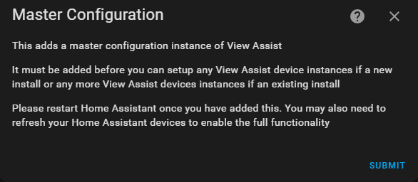

Welcome to the long awaited, much anticipated View Assist integration beta!  

A HUGE thank you goes out to Mark Parker @msp1974 for his MASSIVE help with making this a reality.  Mark has written the majority of the integration with my guidance.  You should check out his [Home Assistant Integration Examples](https://github.com/msp1974/HAIntegrationExamples) Github if you are intestered in creating your own integration.  His work has propelled View Assist to first class in very short order.  We would not be where we are today without his continued efforts and the hours and hours he has put in to make View Assist better!  Thanks again Mark!

# Installing the View Assist Integration

## Notes for existing VA users

**A BIG warning for folks who will be updating.  This is a major rewrite so you will be starting from scratch for the most part.  You will definitely want to do a backup of your current VA settings and views and possibly save a copy of your current dashboard to avoid from losing something you would like to keep!**

You will want to delete your View Assist dashboard before installing.  I suggest that you save your dashboard as a text file (Raw configuration copy/paste).  You will need to UPDATE your View Assist blueprints using the new blueprints.  This is done by importing the new version of the blueprint and choosing to update the existing.  This SHOULD allow for you to keep all settings but be warned that this is beta so problems may exist with keeping these settings in some cases.

## HACS
* Install HACS if you have not already
* Open HACS and click three dots in right corner -> Custom Repositories -> then paste `https://github.com/dinki/view_assist_integration/` in 'Repository' and choose type 'Integration' then click 'Add'
* Now search for 'View Assist' in HACS
* Click "Add" to confirm, and then click "Download" to download and install the integration
Restart Home Assistant
* Search for "View Assist" in HACS and install then restart
* In Home Assistant go to Settings -> Devices and Services -> Add integration -> Search for View Assist and add
* Configure the device(s)

## Manual Install

This integration can be installed by downloading the [view_assist](https://github.com/dinki/view_assist_integration/tree/main/custom_components) directory into your Home Assistant /config/custom_components directory and then restart Home Assistant.  We have plans to make this easier through HACS but are waiting for acceptance.

## Master Configuration

For new users, when adding the View Assist integration, it will force the adding of this master config instance. Subsequent adds will bring up the type selection and follow the previous config flow.

Once the View Assist integration is installed you will receive a notice that the 'Master Configuration' has been created.  Hit 'Submit' to proceed.

If you are an existing user, upon HA reboot after upgrading, you will get a discovered entry in Devices & Services to add this master configuration instance. The message when adding requests another reboot after adding. This is to move the management of the above list of things the master configuration instance does to this new instance. Prior to creating this instance, these things are split between the first instance and the first display instance (they could be the same).

At present, if you select configure on the master config instance, you will get a message that master config options will be added here in the future. This is a holding message as you cannot remove the configuration option on 1 instance. When we have defined 'global' options here, it will load that config form.